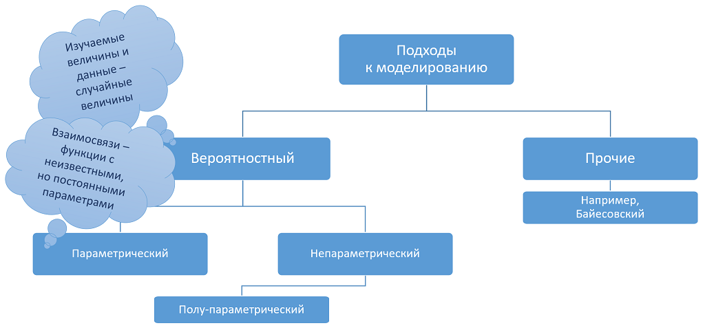
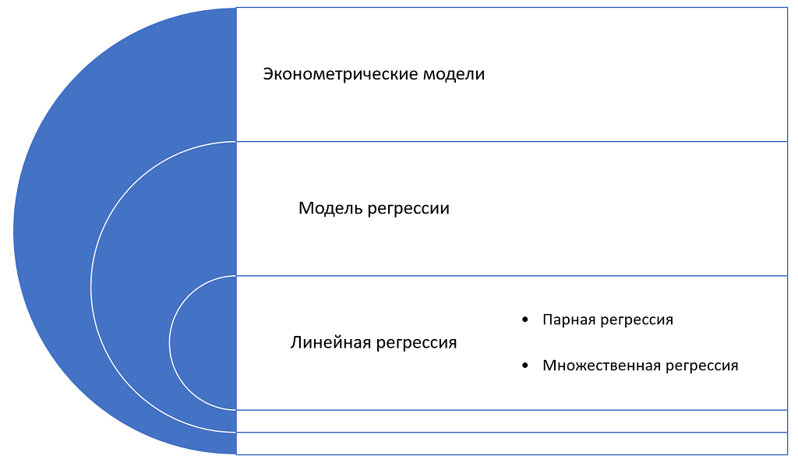

class: section, animated, zoomIn
# Модель
## Что это такое?

---
class: animated, fadeIn
## Подходы к моделированию в эконометрике

---
class: animated, fadeIn
## Иерархия моделей

---
class: animated, fadeIn
.gb[Пример 2.9] **"Регрессия на константу"**

--

Рассмотрим модель простого измерения со случайной ошибкой

\begin{equation}
  x=\mu+u,\tag{2.1}
\end{equation}

--

где $x$ - результат измерения,

--

$\mu$ - значение измеряемой характеристики,

--

$u$ - ненаблюдаемая случайная ошибка измерения, при этом

--

\begin{equation}
  \mathbb{E}u=0,\;\mathbb{E}u^2<\infty,\tag{2.2}
\end{equation}

--

и мы располагаем случайной выборкой $\{x_i\}_{i=1,...n}.$

---
class: animated, fadeIn
.gb[Пример 2.9] **"Регрессия на константу"**

Альтернативная запись:

\begin{equation}
  x_i=\mu+u_i,\;\mathbb{E}u_i=0,\mathbb{E}u_i^2<\infty,\;\{(x_i,u_i)\}_{i=1,...n}\sim\text{i.i.d.}
\end{equation}

 

--

.bb[?] В чем разница?

--

 

\begin{equation}
  x=\mu+u,\;\mathbb{E}u=0,\mathbb{E}u^2<\infty,\;\{x_i\}_{i=1,...n}\sim\text{i.i.d.}
\end{equation}

---
class: animated, fadeIn
.gb[Пример 2.9] **"Регрессия на константу"**

Популяционные свойства и их выборочные аналоги:

--

$$\mathbb{E}x_i=\mathbb{E}(\mu+u_i)=\mathbb{E}\mu+\mathbb{E}u_i=\mu$$

--

$$\frac{1}{n}\sum_{i=1}^n x_i=\hat\mu$$

--

По ЗБЧ: .rmk[.left[.rb[NB!] благодаря i.i.d. ]]

\begin{equation}
  \hat\mu\xrightarrow[n\to\infty]{p}\mathbb{E}x_i=\mu
\end{equation}

---
class: animated, fadeIn
## 

---
class: animated, fadeIn
## 

---
class: animated, fadeIn
## 

---
class: animated, fadeIn
## 

---
class: animated, fadeIn
## 

---
class: animated, fadeIn
## 

---
class: animated, fadeIn
## 

---
class: animated, fadeIn
## 

