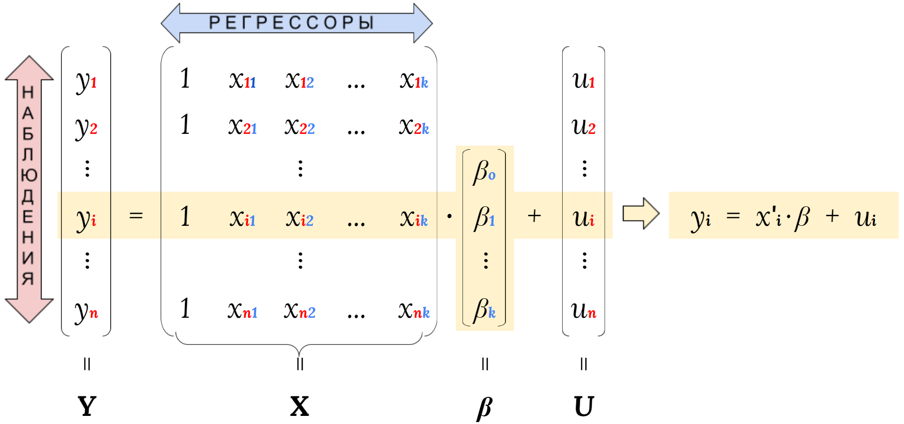

class: animated, fadeIn
## Место ММЛР в иерархии моделей

 - **М**одель **М**ножнственной **Л**инейной **Р**егрессии
 
--

 - Модель *регрессии в среднем*
 
--

 - Модель *линейной регрессии*
 
--

 - Включает $\ge1$ регрессора (*не считая константу*)
 
.right[.rmk[.rb[!]*парная линейная регрессия* - частный случай ММЛР]]

--

.left[.rmk[.bb[?]а что с *регрессией на константу?*]]

---
class: animated, fadeIn
## Пример записи ММЛР
.right[.rmk[мы уже видели...]]

--

$$y_i=\beta_o+\beta_1x_i+\gamma z_i+u_i,$$
$$\mathbb{E}[u_i|x_i,z_i]=0,$$

$$\color{blue}{...}$$

---
class: animated, fadeIn
## Пример записи ММЛР
.right[.rmk[мы уже видели...]]

$$y_i=\beta_o+\beta_1x_i+\gamma z_i+u_i,$$

$$\mathbb{E}[u_i|x_i,z_i]=0,$$

$$\text{Var}[u_i|x_i=x,z_i=z]=\sigma^2(x,z)<\infty,$$

---
class: animated, fadeIn
## Пример записи ММЛР
.right[.rmk[мы уже видели...]]

$$y_i=\beta_o+\beta_1x_i+\gamma z_i+u_i,$$

$$\mathbb{E}[u_i|x_i,z_i]=0,$$

$$\text{Var}[u_i|x_i=x,z_i=z]=\sigma^2(x,z)<\infty,$$

$$\mathbb{E}[(1\;\;x_i\;\;z_i)'(1\;\;x_i\;\;z_i)]\;-\;\text{матрица полного ранга}$$

---
class: animated, fadeIn
## Формы записи ММЛР

.pull-left[- по наблюдениям
 
 - в скалярах

 - в векторах

- матричная]

--

.pull-right[
- в популяции
 
- выборочный аналог]

---
class: animated, fadeIn
## ММЛР: скалярная форма записи

$$y_i = \beta_o + \beta_1x_{i1} + \beta_2x_{i2} + ... + \beta_kx_{ik}+u_i,$$
--

$$\mathbb{E}[u_i|x_{i1},...x_{ik}]=0,$$

--

$$\mathbb{E}[u_i^2|x_{i1}=x_1,...x_{ik}=x_k]=\sigma^2(x_1,...x_k)<\infty,\forall x_1,...x_k,$$ 

--

$$\mathbb{E}[(1\;\;x_{i1}\;\;\cdot\cdot\cdot\;\;x_{ik})'(1\;\;x_{i1}\;\;\cdot\cdot\cdot\;\;x_{ik})]\;-\;\text{матрица полного ранга},$$
--

$$\{(y_i,x_{i1},...x_{ik},u_i)\}_{i=1,...n}\sim\text{i.i.d.}$$

---
class: animated, fadeIn
## ММЛР: векторная форма записи

$$y_i=x_i'\beta+u_i,$$
--

\begin{align}
  y_i&\;-\;1\times 1\;\text{скаляр}\\
  x_i=(1\;x_{i1}\;x_{i2}\;\cdot\cdot\cdot\;x_{ik})'&\;-\;(k+1)\times 1\;\text{вектор}\\
  \beta=(\beta_o\;\beta_1\;\beta_2\;\cdot\cdot\cdot\;\beta_k)'&\;-\;(k+1)\times 1\;\text{вектор}\\
  u_i&\;-\;1\times 1\;\text{скаляр}
\end{align}

--

$$\mathbb{E}[u_i|x_i]=0,$$

--

$$\mathbb{E}[u_i^2|x_i=x]=\sigma^2(x)<\infty,\;\forall x,$$

--

$$\mathbb{E}[x_ix'_i]=Q_{xx}\;-\;\text{матрица полного ранга},$$

--

$$\{(y_i,x_i,u_i)\}_{i=1,...n}\sim\text{i.i.d.}$$

---
class: animated, fadeIn
## ММЛР: матричная форма записи

$$y_\color{red}i=x_\color{red}i'\beta+u_\color{red}i,$$

---
class: animated, fadeIn
## ММЛР: матричная форма записи

$$y_\color{blue}1=x_\color{blue}1'\beta+u_\color{blue}1,$$
--

$$y_\color{blue}2=x_\color{blue}2'\beta+u_\color{blue}2,$$

--

$$y_\color{blue}3=x_\color{blue}3'\beta+u_\color{blue}3,$$
$$y_\color{blue}4=x_\color{blue}4'\beta+u_\color{blue}4,$$
--

$$\cdot\cdot\cdot$$
$$y_\color{red}i=x_\color{red}i'\beta+u_\color{red}i,$$
--

$$\cdot\cdot\cdot$$

$$y_\color{blue}n=x_\color{blue}n'\beta+u_\color{blue}n,$$
---
class: animated, fadeIn
## ММЛР: матричная форма записи

$$Y = X\beta+U,$$
--

\begin{align}
  Y = (y_1\;y_2\;\cdot\cdot\cdot\;y_n)' &\;-\;n\times 1\;\text{вектор},\\
  X = (x_1\;x_2\;\cdot\cdot\cdot\;x_n)'&\;-\;n\times (k+1)\;\text{матрица},\\
  \beta = (\beta_o\;\beta_1\;\cdot\cdot\cdot\;\beta_k)'&\;-\;(k+1)\times 1\;\text{вектор},\\
  U = (u_1\;u_2\;\cdot\cdot\cdot\;u_n)' &\;-\;n\times 1\;\text{вектор}
\end{align}

---
class: animated, fadeIn
## ММЛР: матричная форма записи

---
class: animated, fadeIn
## 

---
class: animated, fadeIn
## 

---
class: animated, fadeIn
## 

---
class: animated, fadeIn
## 

---
class: animated, fadeIn
## 

---
class: animated, fadeIn
## 

---
class: animated, fadeIn
## 

---
class: animated, fadeIn
## 

---
class: animated, fadeIn
## 

---
class: animated, fadeIn
## 

---
class: animated, fadeIn
## 

---
class: animated, fadeIn
## 

---
class: animated, fadeIn
## 

---
class: animated, fadeIn
## 

